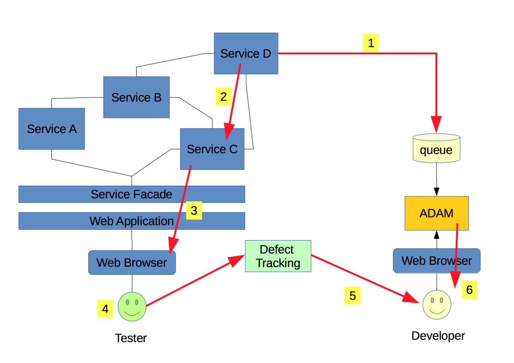
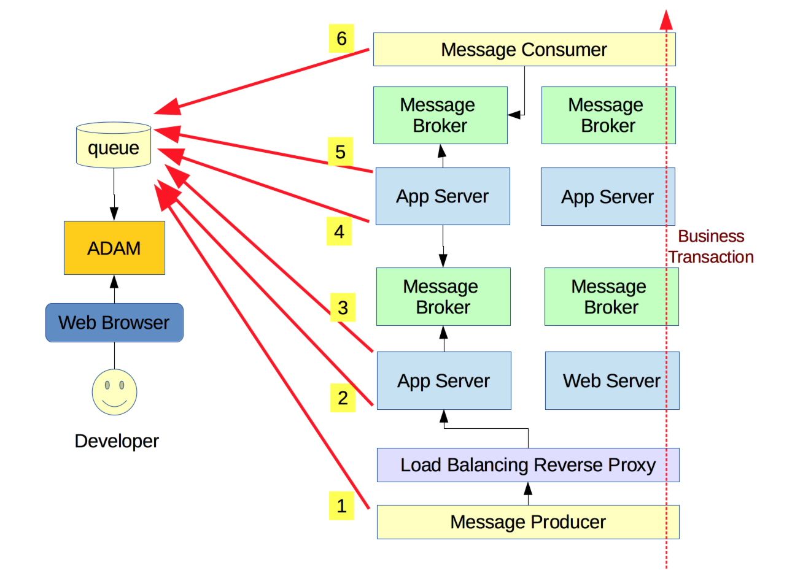
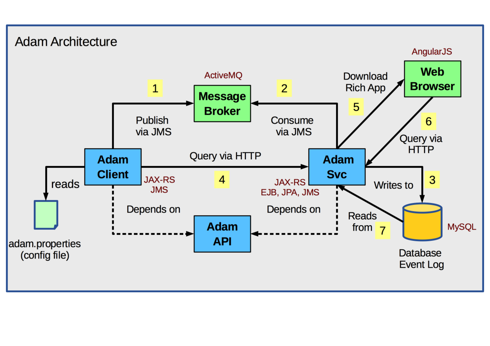
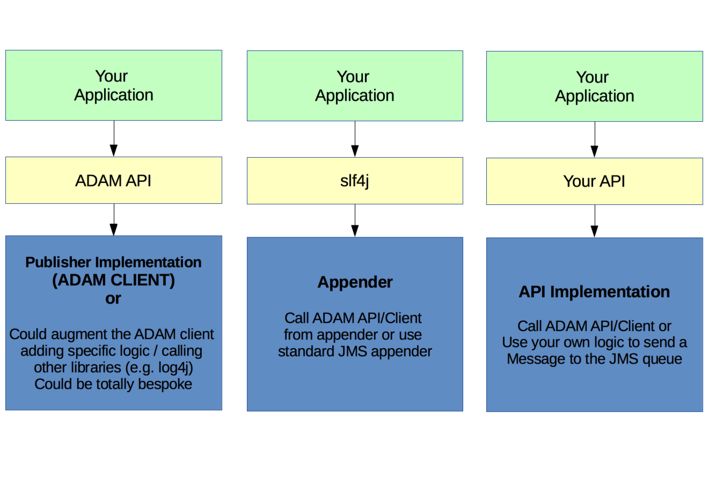

<a name="adam"></a>
#ADAM

ADAM is an event aggregator micro service that records system events in a central location for debugging and performance tuning purposes, and is particularly useful in distributed software architectures following [SOA](http://www.service-architecture.com/articles/web-services/service-oriented_architecture_soa_definition.html) or [MSA](http://microservices.io/patterns/microservices.html).
## Index
1. [Overview](#overview) 
2. [Usage Scenarios](#usage_scenarios)          
2. [Architecture](#architecture)   
3. [Integration Tests](#integration_tests)
3. [Configuration](#configuration)

<a name="overview"></a>
## Overview

When an application is composed of multiple distributed services (e.g. following a Service Oriented Architecture or a Micro Service Architecture) integration and performance testing becomes harder. Usually, when there are problems with the solution, development teams need to search for event information in multiple server logs scattered across the solution. 

ADAM addresses this problem by capturing and recording events published by various services into a centralised log. This log is accessible via both, a RESTful API and a Web User Interface.

<a name="usage_scenarios"></a>
## Usage Scenarios
  
To help understand how ADAM works and can be used to assist in projects, two key usage scenarios are presented below.

<a name="root_cause"></a>
### **Understanding the root cause of errors**
For example, during functional testing an error occur in a specific a user journey. As the user interface is consuming various backend services, and without any specific aiding tool, the development team would need to look through server logs potentially in different servers to find the root cause of the problem. Depending on the number of services in the solution, this can be a time consuming and painstaking exercise.   
  
With ADAM's help, a user can be presented with a unique ticket number at the time the error occurred. The user can raise a ticket to fix the problem including this reference number in description of the problem. The development team can take that reference and use ADAM to find the stack trace showing the service that caused the problem and (hopefully) the reason for the problem, almost immediately.  

For this scenario to work, the develoment team needs to publish an event with the correct information everytime each of the services in the solution fails. The error event has a unique identifier and relevant error and context information. ADAM provides an [API](adam.api/src/main/java/org/gatblau/adam/EventInfoClient.java) to publish event messages to a JMS message queue.
   
It is also important that the unique event identifier is propagated all the way to the User Interface and presented to the user so that it can be logged in a defect report.

The following diagram shows this typical usage scenario:


**1.** Service D fails as a result of a requested action triggered by the web application providing user interface services. As a result, the failure is identified and a unique event identifier is created. The event identifier along with error information is published to a specific JMS message queue.    
**2.** Service D passes the event identifier back to Service C.    
**3.** Service C passes the event identifier back to the Web Application where it is displayed to the user, which in this case is a functional tester.   
**4.** The tester logs the defect in the defect tracking system specifying the unique identifier for the event and the position in the user journey where the error occurred.   
**5.** A developer picks the next defect to work on from the defect tracking system and finds the unique event identifier.   
**6.** Using the event identifier, the developer queries the event information in ADAM.

**NB**: another alternative is to search for events in ADAM without waiting for a defect to be logged. This can offer a good alternative when the system is in production to monitor potential issues and fix them as they appear.

[back to top](#adam)
  
<a name="performance_degradation"></a>
### **Identifying areas degradating performance**
For example, a performance testing team monitoring the throughtput of messages through a sequence of services in a system finds a bottleneck. The bottleneck could be manifested in different ways, for example, timeouts on the front end web servers (see point 2 in figure below).  
To find out where the issues are, the development team publishes debugging events to show when a specific service operation is called and when it finishes execution. In the diagram below, this corresponds to points 1 to 6:

All events published across services are correlated using a unique business transaction identifier or process identifier so they can be queried and displayed together to find the delay in the chain across service calls. This identifier is different to the one in the previous scenario, as all events within the same business process will need to carry the same identifier. This is in addition to the unique event identifier described above.

A good practice is to create a message context when the request is first received in point 2, with the unigue Id that identifies the request. This Id is added to the message context and traverse the various services as the message passes through them. Then, the id can be obtained from the message context and an information event can be sent with this Id every time key service operations start and complete execution.

All time stamps in the events have to be converted to the same time zone and server times have to be in sync. 

Once recorded, a query to ADAM by process Id should display correlated events in the time sequence they occurred. Thus, allowing to report on and understand the latency between service calls.

[back to top](#adam)
<a name="architecture"></a>
## Architecture
### Overview

ADAM provides three artefacts as follows:

**ADAM.API**: this is a light weight artefact that contains the interfaces for ADAM's Service, Web and Message clients; and the POJO - i.e. [EventInfo](adam.api/src/main/java/org/gatblau/adam/EventInfo.java) - that models a system event and allows to serialise its data over the wire. It is part of the API of both, the Web (HTTP) and the Message (JMS) clients.   

The Web Client API provides programatic access to the Web Service API, whilst the Message Client API allows services to publish events for consumption by ADAM.

**ADAM.CLIENT**: this artefact provides the default implementations for the Web Client (using the JAX-RS client specification) and the Message Client (using a JMS message producer to publish event messages asynchronously).   

The client library relies on a property file (i.e. adam.properties), which must located at the root of the project that uses the client to publish events.    
It allows to configure the message broker URI and the name of the queue where messages should be published. It also defines the name of the system publishing events and the name of the node or server running the service. These values can be changed at deployment time depending on the requirements of the specific environment.   

The following excerpt shows an example of the content of the adam.properties file:
<pre>
   <code>
		uri=failover:(tcp://localhost:61616)?timeout=3000
		queue=SystemEventsQueue
		service=Test-Service
		node=Test-Node
   </code>
</pre>

**NOTE!**: if the client configuration file is missing or not found, the Message Client will not create a connection with the message broker and will disable the publication of events without failing. This feature can be used when you want to switch off publication without changing the code that raises the events in your application, via the Message Client API.

**ADAM.SVC**: this artefact provide three distinct services as follows:   

1. **An HTTP service**: implementing the [EventInfoService](adam.api/src/main/java/org/gatblau/adam/EventInfoService.java) interface, providing access to the event message store.   
2. **A JMS message consumer service**: consuming system event messages from the specified queue and persisting them to the message store.   
3. **A rich client application service**: providing a user interface to access the HTTP service from a Web Browser.

[back to top](#adam)

### Application View 

The following image shows Adam's application architecture:



1. Adam client publishes a message to a named queue in the message broker. Broker information is stored in adam.properties file so it can be changed when deploing to different environments.  

2. Adam service consumes messages in the queue. Connection information is stored in the jboss-ejb3.xml and standalone.xml files.

3. Adam service saves the consumed message into a SQL database table.

4. Event information can be queried over HTTP by accessing the Adam Service endpoint (e.g. http://localhost:8080/adam/wapi). Adam client offers a programattic API to facilitate HTTP calls to the service.

5. Alternatively, a JavaScript rich client application can be loaded in a web browser and used to query the event log.

6. Queries are done by the rich client to the service HTTP endpoint.

7. Data is read from the database and sent to the client over HTTP.


### Information View
The [EventInfo](adam.api/src/main/java/org/gatblau/adam/EventInfo.java) POJO defined in the ADAM API artefact, provides the means to submit and serialise system event information. 

The following table describes the name, description and context of use of each of its fields:

| Name  | Description | Context of Use |
|:-----------|:------------|:---------------|
| eventId    | The unique identifier for the event. | Create a unique Id and attach it to this field at the time of publishing the event. Also propagate this Id to the UI. This allows to log a defect with the Id and use the Id to retrieve the event information later when fixing the defect.   
| processId | The unique identifier for the business process the event was raised from. | Use this identifier to correlate events when instrumenting a process for performance monitoring purposes. See [usage scenario 2](#performance_degradation) for more information on how to use this field.
| code | A data field to be used as a dimension for query purposes. | For example, when the event type is an error, this field can contain the error code for the event (debugging scenario). If the event is for information, the code can contain the method within which the event was send as well as a flag to indicate if it was send at the start or the end of the method (performance information scenario). Alternatively, it can be used to store any attribute not considered explicitly by the current model for reporting purposes. 
| description | A short and readable description of the event. | This field should contain a brief and readable description of the problem that caused the error ([EventType](adam.api/src/main/java/org/gatblau/adam/EventType.java).ERROR) or a summary of the information ([EventType](adam.api/src/main/java/org/gatblau/adam/EventType.java).INFO) or warning ([EventType](adam.api/src/main/java/org/gatblau/adam/EventType.java).WARNING) recorded in the event. 
| node | The name of the server or container in which the event occurred. | Use this field to store the identifier for the server or container from which the event was sent. This can be useful in scaled out environments to identify the node within the solution topology where activity was recorded.
| service | The name of the application raising the event. | Use this field to store the name of the application or service which raised the event.
| info | Stores event related information. | Use this field to store event information. The field can store a large amount of text data and therefore is suitable to store exception stack traces and any other information that can help understanding the cause of a problem. Information can be structured using CSV, JSON, XML or any other format. Use the field to store detailed information, not information used to query events.
| eventTime | The time the event was created. | Event time should be represented in a predefined timezone so that it can be consistently read across servers and applications potentially deployed in geographycally dispersed areas.
| eventType | The type of event. | The type of event based on the [EventType](adam.api/src/main/java/org/gatblau/adam/EventType.java) enumeration. Allowed event types are errors, wanrings or information.

#### Accessing the HTTP service specification at runtime
  
ADAM uses [GEMMA](https://github.com/gatblau/gemma) to publish its functional and technical specification as an HTTP resource under the 
"adam/wapi/spec" path, suporting content negotiation for both JSON and XML formats.

To access the service specification at runtime open the following URI in a browser when ADAM is running in the localhost: [http://localhost:8080/adam/wapi/spec](http://localhost:8080/adam/wapi/spec)

#### Using the command line to query events

The specification above describes the http operations supported by ADAM over HTTP. An administrator can be more effective using the command line to query events from the log.

Tools such as [cURL](http://curl.haxx.se/download.html) can be used for this purpose. The following example, demonstrates how cURL is used to query all events which were correlated to a process with Id = "P01":

<pre>
  <code>
  <b>curl</b> -i -H "Accept: application/xml" 
          -H "Content-Type: application/xml" 
          http://localhost:8080/adam/wapi/event/process/P01
          > eventInfo.xml 
  </code>
</pre>  

The result is presented in XML format and saved into the "eventInfo.xml" file. Apart from using "**> filename**", other cURL options to save the output to a file are "**-o**" and "**-O**". Try "**curl --help**" to see all the available options.

### Using the message client

#### Decoupling the publication of events

When using ADAM client to publish messages, it is good practice to decouple this operation using an interface (facade) such that the implementation can be updated without disrupting the system.

To this extent, ADAM provides a light weight API artefact (ADAM.API) to separate the behaviour from its implementation which is in the client artefact (ADAM.CLIENT).

The following figure shows three alternate approaches to decoupling the publisher, the first one as described before plus two more additional approaches:


### The message client

The message client implementation [EventInfoMessageClientImpl](adam.client/src/main/java/org/gatblau/adam/EventInfoMessageClientImpl.java) is a Singleton CDI bean. If the client is instantiated in a CDI container, then the bean is started and stopped automatically after the bean is created and before the bean is destroyed. However if the bean is instantiated outside a CDI container the start() and stop() methods need to be called to initiate and terminate the connection with the message broker.

The following excerpt shows the publish operation in the message client:

```Java
   	@Override
    public String publish(EventInfo event) {
    	...
    }
```

The following exerpt shows a simplistic view of how to publish an event message:

```Java
	public class MyClass {
		@Inject
		private MessageClient client;
		
		public void myMethod() {
			try {
			   // do something
			}
			catch (Exception e) {
				EventInfo event = createEvent(e);
				client.publish(event);
				throw e;
			}
		}
		
		private EventInfo createEvent(Exception e) {
			// create event instance here...
		}
	}
```
**NOTE**: the client does not make any provision to filter the types of events to publish. This needs to be done by the sender system, depending on requirements. ADAM however, allows to switch off the JMS producer in the client implementation by removing the "**adam.properties**" configuration file.

[back to top](#adam)

<a name="integration_tests"></a>
## Integration Tests

ADAM provides a full set of automated functional tests driven by behaviours defined using [features](adam.client/src/test/resources/features) written in [Gherkin](https://github.com/cucumber/cucumber/wiki/Gherkin). These tests are not unit tests but **black box integration** tests, and therefore, in order for them to pass, they require the environment to be fully configured.

This means that all the message broker, the sql database and the application server must be running, properly configured and the ADAM Web Archive must have been deployed to the application server. The section below explains how to set up such environment.

Once the environment is ready, the tests can be run by navigating to the **adam.client** [root folder](adam.client/) and executing the command "**gradlew -i test**" from the command prompt.

[back to top](#adam)

<a name="configuration"></a>
## Configuration

### Configuration Checklist


The following is an environment configuration checklist which leads to the execution of the automated end to end tests.   

1. Ensure you have installed the message broker. It can be downloaded from [here](http://activemq.apache.org/download.html). 
2. Once unzipped, start the broker by executing **activemq start** from the command line. 
3. Check the broker is running on [http://localhost:8161](http://localhost:8161).  
2. Ensure the broker has a message queue with the name **SystemEventsQueue**. This can be done via the [broker console](http://localhost:8161/admin). After logging in (username & pwd = "admin"), click on [Queues](http://localhost:8161/admin/queues.jsp) and then type the queue name in the textbox and click create. 
3. Ensure you have a [MySQL server](https://dev.mysql.com/downloads/mysql/) installed in your localhost with default credentials username = "root"; password= "".
4. Create the database as described above.
3. Ensure you have the [JBoss EAP](https://www.jboss.org/products/eap/download/). Download the zip file and unzip on a location of choice.
4. Download and install the MySQL jdbc driver in JBoss EAP
5. Configure the datasource in the JBoss configuration file
6. Configure the message consumer in the JBoss configuration file
7. Start the JBoss EAP server
8. You need to install the [Bower](http://bower.io/) JavaScript package manager for this step. Once installed, open the command line and change directory to the AngularJS application [folder](adam.svc/src/main/webapp/app) where the [bower.json](adam.svc/src/main/webapp/app/bower.json) file is located. Then execute the command "**bower update**". This should download all the required JavaScript dependencies to the "app/bower_components" folder.
8. Package the Web Archive - e.g. **gradlew build -x test**
9. Deploy the ADAM war file - e.g. **gradlew cargoRemoteDeploy**
9. Execute the ntegration tests - e.g. **gradlew -i test**
10. All the above can be done as follows: **gradlew war cargoRemoteDeploy test**


### Messaging

#### Deploy the Resource Adapter for Active-MQ on JBoss EAP
ADAM uses a message driven bean to consume event messages from a specified queue. To allow JBoss EAP to consume messages from the queue of an external Active-MQ message broker, it is necessary to [install the Active-MQ resource adapter into the JBoss EAP container](https://access.redhat.com/documentation/en-US/Red_Hat_JBoss_A-MQ/6.1/html-single/Integrating_with_JBoss_Enterprise_Application_Platform/). 

This [link](http://activemq.apache.org/jboss-integration.html) provides information on how to obtain the resource adapter rar file. The resource adapter should be compatible with the version of the message broker in use and be stripped of any version number in its name (i.e. "**activemq-rar.rar**"). This is required as the adapter filename is referenced in code and configuration files as explained below.

#### Configure the deployed resource adapter

Once the resource adapter has been deployed in JBoss EAP, it needs to be [configured in the server configuration file](https://access.redhat.com/documentation/en-US/JBoss_Enterprise_Application_Platform/6.4/html/Administration_and_Configuration_Guide/Configure_a_Deployed_Resource_Adapter1.html) so that it can be used.

For information, a simple example of how the resource adapters subsystem could look like to connect JBoss EAP to a local instance of the ActiveMQ message broker is shown below:

```xml
<subsystem xmlns="urn:jboss:domain:resource-adapters:1.1">
   <resource-adapters>
      <resource-adapter id="activemq-rar.rar">
        <archive>
           <!-- defines the name of the resource adapter rar file -->
           activemq-rar.rar
        </archive>
        <transaction-support>XATransaction</transaction-support>
        <!-- the URI of the message broker to consume messsages from -->
        <config-property name="ServerUrl">
           tcp://127.0.0.1:61616?jms.rmIdFromConnectionId=true
        </config-property>
        <!-- the message broker login username -->
        <config-property name="UserName">admin</config-property>
        <!-- the message broker login password -->
        <config-property name="Password">admin</config-property>
        <!-- the connection properties -->
        <connection-definitions>
           <connection-definition class-name="org.apache.activemq.ra.ActiveMQManagedConnectionFactory" jndi-name="java:/ConnectionFactory" enabled="true" pool-name="ConnectionFactory">
              <xa-pool>
                 <min-pool-size>1</min-pool-size>
                 <max-pool-size>20</max-pool-size>
                 <prefill>false</prefill>
                 <is-same-rm-override>false</is-same-rm-override>
              </xa-pool>
              <recovery>
                 <recover-credential>
                    <user-name>admin</user-name>
                    <password>admin</password>
                 </recover-credential>
               </recovery>
            </connection-definition>
          </connection-definitions>
          <admin-objects>
            <!-- the queue to pull messages from -->
            <admin-object class-name="org.apache.activemq.command.ActiveMQQueue" jndi-name="java:/queue/systemEvents" use-java-context="true" pool-name="SystemEventsQueue">
               <config-property name="PhysicalName">
                  SystemEventsQueue
               </config-property>
           </admin-object>
        </admin-objects>
     </resource-adapter>
  </resource-adapters>
</subsystem>
```
**IMPORTANT**: the **PhysicalName** property of the admin object (in the resource adapter configuration as shown above) has to match the **destination** property of the message driven bean, as described in the next section.

#### Event Consumer Configuration

The message driven bean consuming the system event messages can be configured through the **jboss-eap3.xml** file located in the WEB-INF folder of the service. The following example shows the consumer configured to read messages from the **SystemEventsQueue** destination:

```xml
<message-driven>
   <ejb-name>SystemEventsService</ejb-name>
   <ejb-class>org.gatblau.adam.EventConsumer</ejb-class>
   <activation-config>
     <activation-config-property>
        <activation-config-property-name>destinationType</activation-config-property-name>
        <activation-config-property-value>javax.jms.Queue</activation-config-property-value>
     </activation-config-property>
     <activation-config-property>
        <activation-config-property-name>destination</activation-config-property-name>
        <activation-config-property-value>SystemEventsQueue</activation-config-property-value>
     </activation-config-property>
     <activation-config-property>
        <activation-config-property-name>acknowledgeMode</activation-config-property-name>
        <activation-config-property-value>Auto-acknowledge</activation-config-property-value>
     </activation-config-property>
   </activation-config>
</message-driven>
```

#### Message Driven Bean

The message driven bean is linked to the **jboss-eap3.xml** configuration via the bean name: 

<pre><code>
@MessageDriven(name = "<b>SystemEventsService</b>")
@ResourceAdapter(value="<b>activemq-rar.rar</b>")
public class EventConsumer implements MessageListener {
   ...
}
</code></pre>

The bean also specifies the name of the resource adapter *.rar file to use and therefore it is important its filename is renamed accordingly. 

### Database

* [Install the JDBC driver](https://access.redhat.com/documentation/en-US/JBoss_Enterprise_Application_Platform/6.4/html/Administration_and_Configuration_Guide/sect-JDBC_Drivers.html#Install_a_JDBC_Driver_with_the_Management_Console) for the database system you want to use.

* [Configure the datasource](https://access.redhat.com/documentation/en-US/JBoss_Enterprise_Application_Platform/6.4/html/Administration_and_Configuration_Guide/sect-Non-XA_Datasources.html) using "**java:/datasources/adam**" JNDI. The following is an example of the configuration required to connect to a local MySQL server instance with no security.

```xml 
<subsystem xmlns="urn:jboss:domain:datasources:1.2">
  <datasources>
     <datasource jta="true" jndi-name="java:/datasources/adam" pool-name="adam" enabled="true">
        <connection-url>jdbc:mysql://localhost:3306/adam</connection-url>
        <driver>mysql</driver>
        <pool>
          <min-pool-size>5</min-pool-size>
          <max-pool-size>15</max-pool-size>
        </pool>
       <security>
          <user-name>root</user-name>
       </security>
       <validation>
          <valid-connection-checker class-name="org.jboss.jca.adapters.jdbc.extensions.mysql.MySQLValidConnectionChecker"/>
          <validate-on-match>true</validate-on-match>
          <exception-sorter class-name="org.jboss.jca.adapters.jdbc.extensions.mysql.MySQLExceptionSorter"/>
       </validation>
     </datasource>
     <drivers>
        <driver name="mysql" module="com.mysql">
           <driver-class>com.mysql.jdbc.Driver</driver-class>
        </driver>
     </drivers>
</datasources>
```
**Note**: for the example above, the MySQL jdbc driver should be [installed as a module](https://access.redhat.com/documentation/en-US/JBoss_Enterprise_Application_Platform/6.3/html/Administration_and_Configuration_Guide/Install_a_JDBC_Driver_as_a_Core_Module1.html) within JBoss EAP.

#### Create the Database 
Create the database to record the system events by executing the following script in the MySQL database server:

```SQL
CREATE DATABASE Adam;

USE Adam;

DROP TABLE IF EXISTS `EventLog`;

CREATE TABLE `EventLog` (
  `id` bigint(20) NOT NULL AUTO_INCREMENT,
  `code` varchar(255) DEFAULT NULL,
  `description` varchar(255) NOT NULL,
  `eventId` varchar(255) DEFAULT NULL,
  `processId` varchar(255) DEFAULT NULL,
  `node` varchar(255) DEFAULT NULL,
  `info` longtext,
  `service` varchar(255) DEFAULT NULL,
  `eventTime` datetime NOT NULL,
  `eventType` varchar(255) NOT NULL,
  PRIMARY KEY (`id`),
  UNIQUE KEY `UK_qfgsgh53as3h27opssgjkwgrj` (`eventId`)
) ENGINE=InnoDB DEFAULT CHARSET=utf8;
   
```
[back to top](#adam)

## Importing project into an IDE 

In order to import the project into IntelliJ or Eclipse run the gradle idea or eclipse plugins to generate the required IDE files. Then  import the project from the respective IDE.

## License 

This project is published under the terms of the [Apache 2.0](http://www.apache.org/licenses/LICENSE-2.0) license.